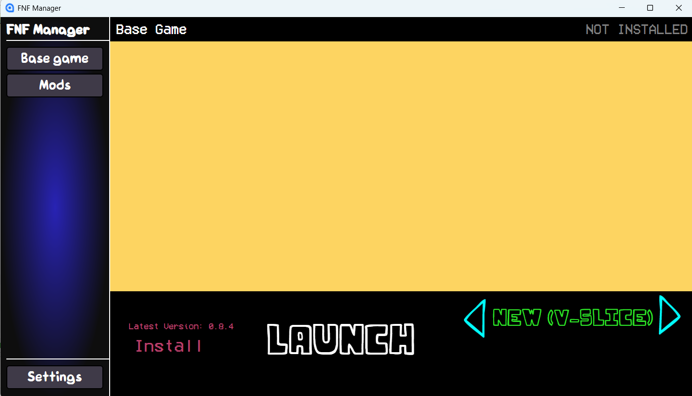
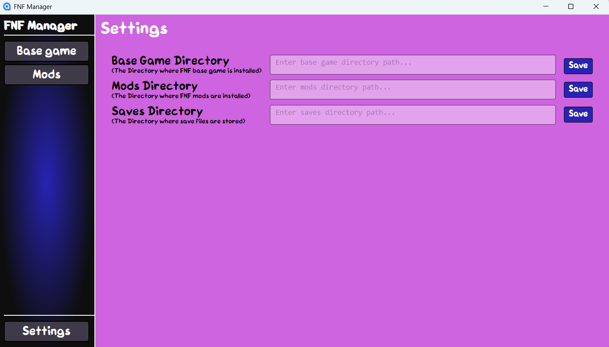

# FNF Manager
An all-in-one app for managing Friday Night Funkin'.

## What is FNF Manager?
FNF Manager is an all-in-one Friday Night Funkin' Manager to manage things like base game, mods, save data, covers, etc.

<!-- Never gonna remember, so here's the symbols: :x: :white_check_mark: :grey_question: :pencil2: -->
## Planned Features
| Feature | Status |
|---|---|
| Base game installation and updates | :x: |
| Mods from GameBanana | :x: |
| Mods from an FNF Manager repository | :grey_question: |
| Mods from a locally downloaded file | :x: |
| Save data management | :x: |
| Cover management | :x: |

:grey_question: Potential feature • :x: Not started • :pencil2: Currently in progress • :white_check_mark: Implemented

## Stage of Development
Currently I'm just in the early UI design stages. Though I'm not going to completely finish the UI first, I feel that it will be easier to work with a base UI with at least the required elements.

### Development Screenshots:

## Credits
As of writing this, the only developer is JohnB of JohnBDev

JohnB <<johnb@johnbdev.net>>

https://johnbdev.net/

## License

FNF Manager's source code is licensed under the Apache License 2.0.

Friday Night Funkin' and related assets belong to their respective owners. FNF Manager is not affiliated with or endorsed by The Funkin' Crew Inc.
